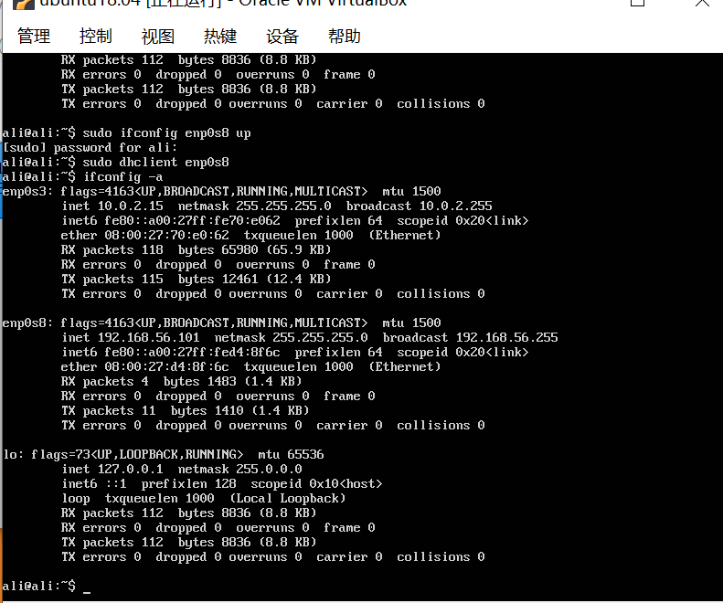
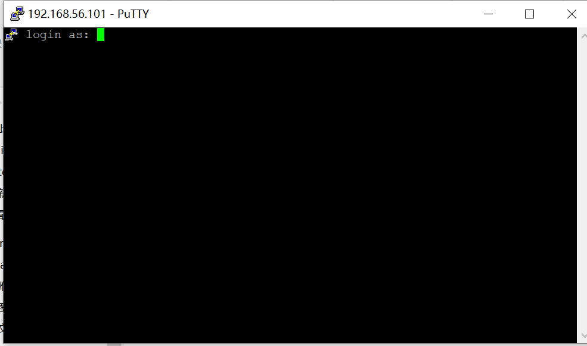
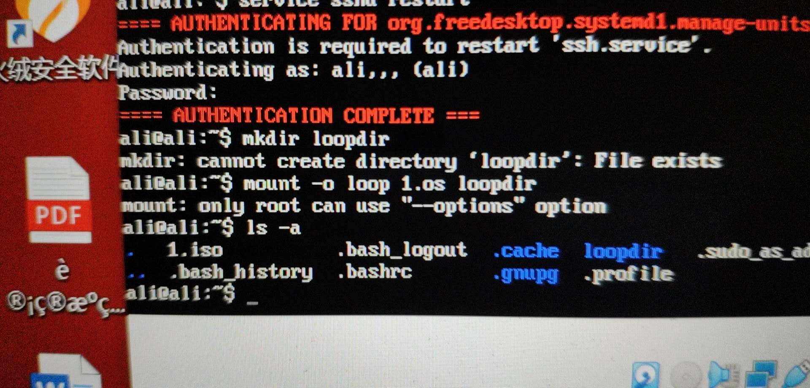
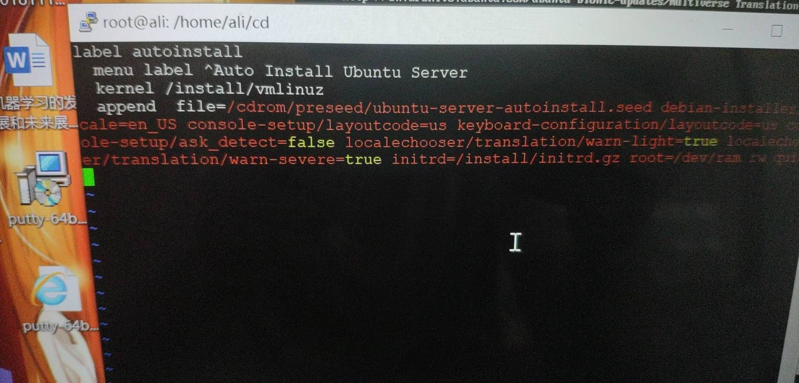
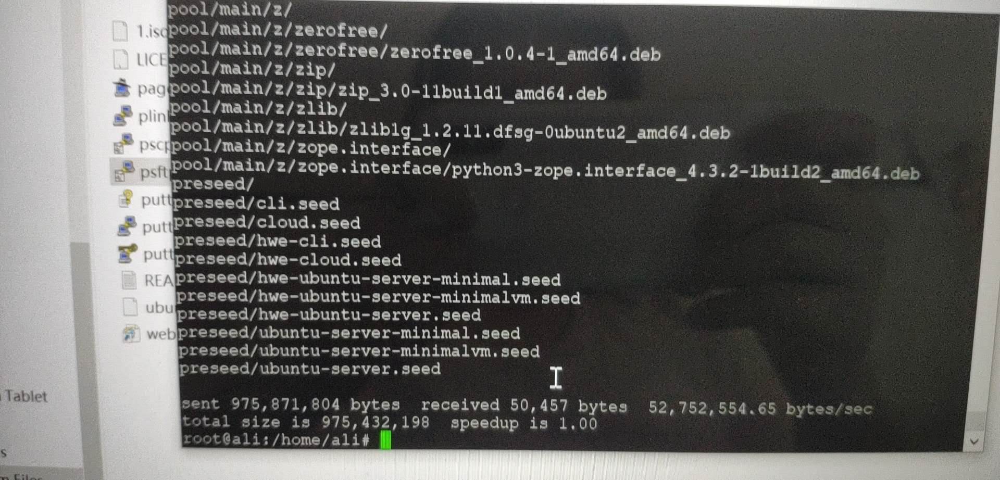
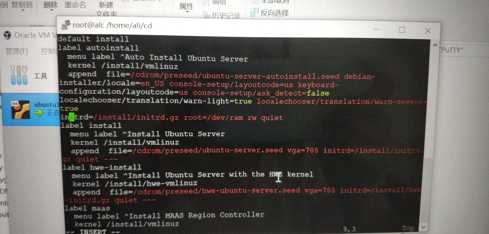

# private-linux-2020-sandyyy0909

### 无人值守安装
安装视频已上传哔哩哔哩，个人主页：
https://space.bilibili.com/64289005/video
（id：想变强的阿珊）

### 安装步骤
网卡设置

然后查看IP地址：

之后将putty与虚拟机相连

不过在过程中出现了问题：

于是我在网页上得知与ssh服务有关

于是我输入service ssh restart便得以解决。

之后再创建loopdir目录

并挂载iso文件

但是实际上我挂载时存在一定的问题导致之后我用vm打开文件时出现错误

而关键在于我在执行创建loopdir文件时没有cd到相关目录去以导致最后打开文件时为空

于是重新按步骤执行一次创建文件挂载iso之后便能正常执行

同步光盘内容到目标工作目录

再卸载iso镜像

之后打开文件将长串内容加入到文件中

之后生成md5sum,txt ，封装改动后的目录到Iso.
最后用psfyp将Isow文件复制出来

再用虚拟机运行便可实现无人值守安装

